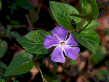
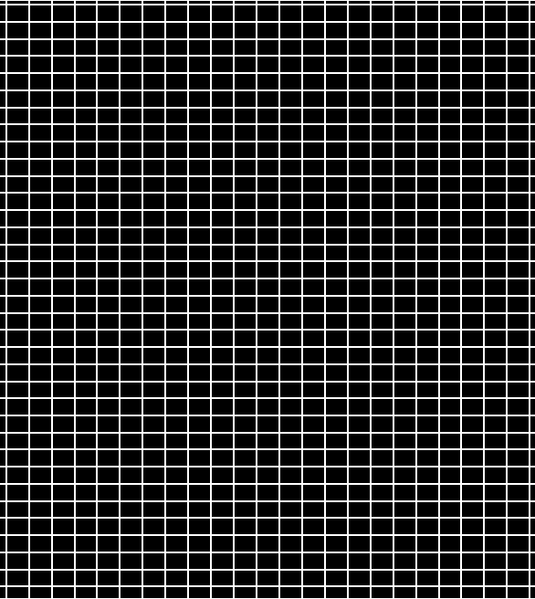
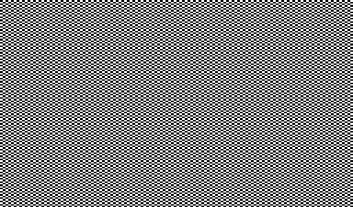
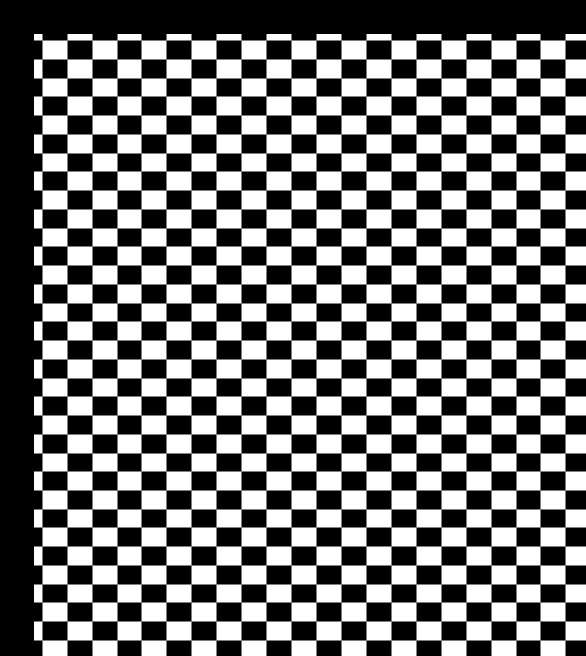

This is the writeup for the first assignment of `CSE 190`. 
I implement all of the techniques except convolution in frequency domain and compositing. 
The mathematics is not complex in this project, most of the work is completed by 
manipulating either pixel value or pixel coordinate directly. Therefore, I will mainly post up
outcomes without mentioning implementing details which are already well written in the assignment instruction.

 
## Basic Operations

### Brighten

Brighten flower.bmp with factor: **0.0,0.5,1.0,1.5,2.0**

  |  |  |  |  | 
:-:|:-:|:-:|:-:|:-:
0.0|0.5|1.0|1.5|2.0        

For negative factor, it will return:

The factor should be non-negative
 

### Change Contrast

Change Contrast of flower.bmp with factor: **-0.5,0.0,0.5,1.0,1.7** 

  |  |  |  |  | 
:--:|:-:|:-:|:-:|:-:
-0.5|0.0|0.5|1.0|1.7  

### Change Saturation

Change Saturation of flower.bmp with factor: **-1.0,0.0,0.5,1.0,2.5** 

  |  |  |  |  | 
:--:|:-:|:-:|:-:|:-:
-1.0|0.0|0.5|1.0|2.5 

### Change Gamma

Change Gamma of flower.bmp with factor: **0.5,1.0,1.5,2.0** 

  |  |  |  
 :--:|:-:|:-:|:-:|:-:
0.5|1.0|1.5|2.0

For negative or zero factor, it will return:

The factor should be positive
 

### Crop

Crop flower.bmp with factor:**(x,y,w,h)=(50,30,80,80)**

If the location (x,y,x+w,y+h) is not valid, it will return:

The corner location is not valid
 

If either w or h is less than zero, it will return:

Width and height should be positive
 

## Quantization and Dithering

Results can be compared with the table below. Here are three points I need to mention:

Firstly, as we know, `FloydSteinbergDither` is a little annoying in that we have to handle potential decimal and negative pixel value. For this problem, I pick out the whole calculation part into a single function, which is `Pixel` in `Pixel` out but process all of the data as float type inside the function.

Pixel FloydSteinOperator (const Pixel& w, const Pixel& p, const Pixel& q, double t);
 

Moreover, handling boundaries' pixels is another problem for `FloydSteinbergDither`. Honestly, I don't care much about these boundaries pixels in my former image processing work. I used to fill zeros or mirror symmetry values around the boundaries. In this project, I try both of the methods mentioned in the assignment instruction: `renormalization` and `toroidal extension`. I won't post up all of the outcome created by these two methods. The only difference lies on the 
boundaries which can barely be discriminated. In my source code, you can change method with the variable `solution`. 
As `toroidal extension` is easier to implement and expend to other cases. I write a separate function for it:

Image* Image::Expand(int n);
 

In addition, I try non-linear mapping in quantization. I use a mapping function like gamma correctness:

q = floor(p/256*b)
w = pow(q/b,factor)
c = floor(255*b*w/(b-1))

It is controlled by the variable `solution`.

### Results:

\#Bits|1 | 2 | 3 | 4 | 5 |
 :--:|:-:|:-:|:-:|:-:|:-:|
Quan(L)| ||||
Random| ||||
FS| ||||
Quan(NL)| ||||

> Quan(L): Normal Quantization   
Random: Random Dither   
FS: FloydSteinberg Dither   
Quan(NL): non-linear Quantization  

 

## Basic Convolution and Edge Detection

I implement an auxiliary Convolve function for this section.

void Image::Convolve(int *filter, int n, int normalization, int absval);
 
For solving the potential problem of negative pixel value, I implement a new class named iPixel(in `iPixel.h` and `iPixel.cpp`)
for storing and calculating `int` value pixels. Also, I use `toroidal extension` to handle the boundaries. Therefore, I do convolution as following procedure: 

	1. Extend the Source Image
	2. Loop for every pixel
	3. Turn Pixel into iPixel
	4. Calculate 
	5. Turn iPixel into Pixel
	
### Blur

Blur mandrill.bmp, firstly turn `float` Gaussian filter into `int` filter. 
With size of: **3,5,7,11,13** , I get:

  |  |  |  | 
 :--:|:-:|:-:|:-:|:-:
3|5|7|11|13

For valid input, it will return:

Filter size n should be an odd integer
 

### Sharpen

Using the filter given in assignment instruction, I sharpen mandrill image blurred by 13*13 Gaussian filter.

With sharpen times from **1 to 5**:

  |  |  |  | 
 :--:|:-:|:-:|:-:|:-:
1|2|3|4|5

### Edge Detection

Using Sobel filter to detect edges:

checkerboard.bmp and checkerboard2.bmp have very "strict" edge, they are robust to different thresholds:

For wave.bmp, I try threshold from 50 to 250:

  |  |  |  | 
 :--:|:-:|:-:|:-:|:-:
50|100|150|200|250

As shown above, we can get satisfying edges with threshold around 200.

## Antialiased Scale and Shift

I give up the auxiliary Convolve function in this section. 
Instead, I implement all of techniques with two or more 1D processing. Fortunately, the coordinates of every pixel
required in the source image for calculating the goal image can be known with a simple close-form solution.
It is unnecessary to search every satisfying pixels with global loop.

For solving the potential problem of decimal pixel value, I implement a new class named fPixel(in `fPixel.h` and `fPixel.cpp`)
for storing and calculating `double` value pixels.

Also, as I use for loop condition to choose the pixels required for calculation. I don't need to extend the image here.
On the other hand, a general normalization is a must.

>In my code, I use the variable `solution` to control the filter.

### Scale

With three different filters, I scale checkerboard.bmp to different size:

size|300*512 | 512*300 | 300*300 | 800*800 | 
 :--:|:-:|:-:|:-:|:-:|
NN| ||||
Hat| ||||
Mitchell| ||||

### Shift

With three different filters, I shift checkerboard.bmp:

(tx,ty)| (35.2,35.2) | (35.3,-35.3) | (-35.5,35.5) | (-35.7,-35.7) | 
 :--:|:-:|:-:|:-:|:-:|
NN| ||||
Hat| ||||
Mitchell| ||||

Also I implement a QT widget for illustrating shift process.
Unfortunately, the Shift processing is not fast enough for an online demonstration. 
I have to shift the image in advance, and save them for QT to load.
In order to show non-integer shift, I set shift in range -10 to 10 with an increment of 0.2.

 

 

