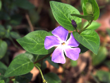
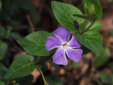

This is the report for the first assignment of CSE 190. With great fun in these three weeks, I implement almost all of the techniques except convolution in frequency domain and compositing. As I work alone on this project, please don't criticize me too much on not leaving enough comments on my code. I will try my best to explain my work in this writeup. At last, thank *Ravi* for this great assignment.

## Basic Operations
There is nothing complex in this section. I will briefly post up my result below. 

### Brighten
Using command:

./image -brightness factor <flower.bmp >out.bmp
 
With factor: **0.0,0.5,1.0,1.5,2.0**

For negative factor, it returns:

The factor should be non-negative
 

### Change Contrast
Using command:

./image -contrast factor <flower.bmp >out.bmp
 
With factor: **-0.5,0.0,0.5,1.0,1.7** 

### Change Saturation
Using command:

./image -saturation factor <flower.bmp >out.bmp
 
With factor: **-1.0,0.0,0.5,1.0,2.5** 

### Change Gamma
Using command:

./image -gamma factor <flower.bmp >out.bmp
 
With factor: **0.5,1.0,1.5,2.0** 

For negative or zero factor, it returns:

The factor should be positive
 

### Crop
Using command:

./image -crop x y w h <flower.bmp >out.bmp
 

With factor:**(x,y,w,h)=(50,30,80,80)**

If the location (x,y,x+w,y+h) is not valid, it returns:

The corner location is not valid
 

If either w or h is less than zero, it returns:

Width and height should be positive
 

