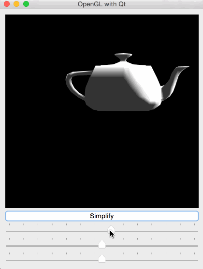
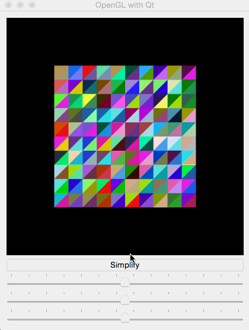
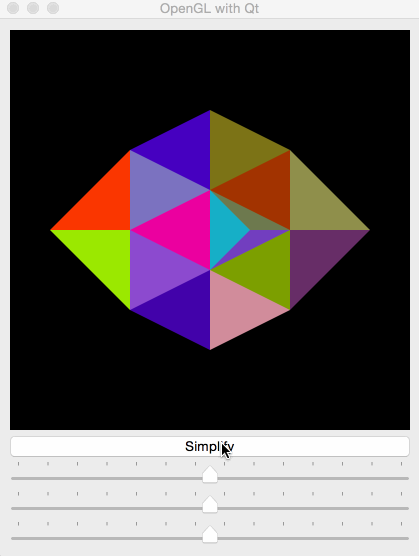
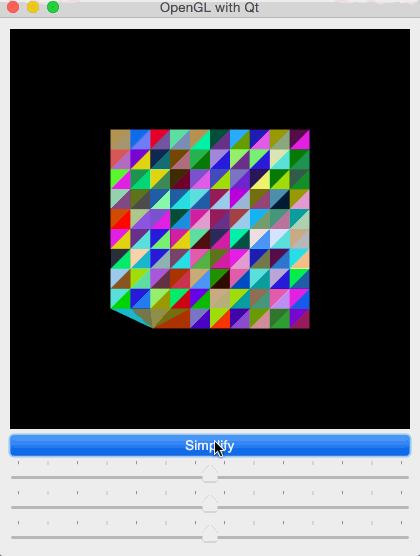
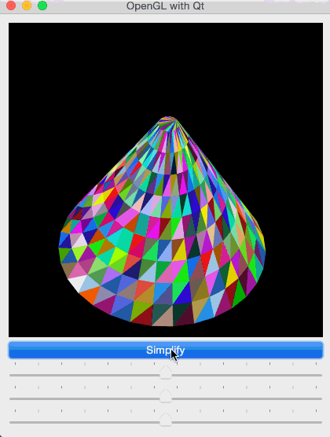
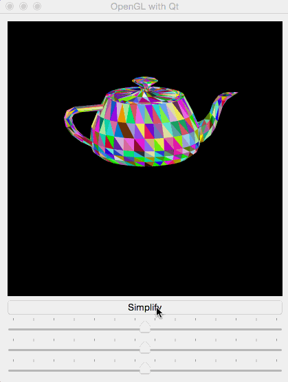
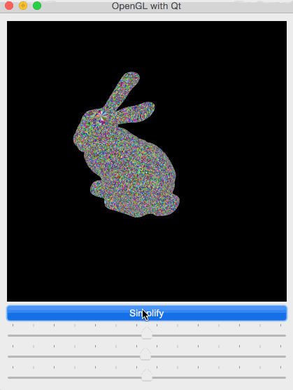
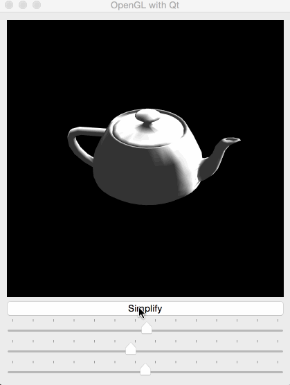
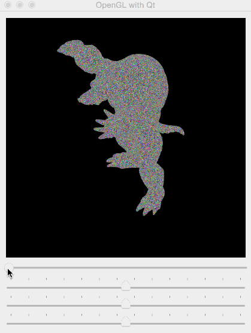

This is the writeup for the second assignment of `CSE 190`. Data structure is everything in this project, so in the beginning, I will briefly summarize my analysis of mesh simplification problem and explain the reason why I choose these structures. After that, I will post up the results from single test models to the large complex ones. 

## Analysis

### General 

Using `indexed face set` with `vertex to face adjacency table` is quite straight forward. However, structures details depend on the operations required.

### Edge Collapse

In an `edge collapse` procedure, we need to:

1. Find two vertices **v0**, **v1** in the vertices set. Remove these two vertives and insert a new vertex **v**
2. Find all the faces adjacent to **v0**, **v1**
3. Change all **v0**, **v1** in the adjacent faces to **v**
4. Remove the common faces of **v0**, **v1**
5. Insert adjacent faces of **v**, update the adjacency table for the vertices adjacent to **v0**, **v1**, and remove **v0**, **v1**

Beside that, for illustration, we have to update *vertices normals*, *faces normals* and *faces colors* properly.

### Quadric Simplification

The structure in this section is simple. We need a *Q matrices* structure, which is basically the same as *vertices normals*. In addition, there must be a structure for ordered edges. The total procedure would be like:

1. Find least cost edge **e** = (**v0**, **v1**)
2. Collapse **v0**, **v1**
3. Remove **v0**, **v1** in Q matrices and add **v**
4. Remove **e**, update cost of edges of all vertices adjacent to **v0**, **v1**
5. Sort edges

### Structures and Operations

In sum, we need the structures to do following operations:

| Name             | Contents              | Operations                      |
| :---:            | :--:                  | :---:                           |
| Vertices         | (x,y,z) coordinate(3) | Look up; Insert; Remove         |
| Faces            | vertices index(3)     | Look up; Update; Remove         |
| V2F Adjacency    | faces index(N)        | Look up; Update; Insert; Remove |
| Faces Normals    | (x,y,z) coordinate(3) | Look up; Update; Remove         |
| Vertices Normals | (x,y,z) coordinate(3) | Look up; Update; Insert; Remove |
| Face Colors      | color value(3)        | Look up; Remove                 |
| Q matrices       | Q value(4*4)          | Look up; Insert; Remove         |
| Edges            | cost(1) and vertices index(3)              | Look up; Update; Insert; Remove; Sort                               |
    
- The Number between parenthesis denotes the dimension of each element in its structure. 
- In Faces structure, as I store all of faces adjacent to one vertex, the number is unknown beforehand, so I write N. 

*Vertices to vertices adjacency* can be obtained from *Vertices to Faces adjacency* and *Faces*. I don't introduce edges adjacency as it is useless for our purpose. However, there is a special case: connected vertices which don't share a face won't find each other. Assume that there is a 'solitary' triangle **ABC**, if we collapse edge *AB** to **B'** in a way which makes **B'** and **C** adjacent to each other but they don't share a face, next time, when we update **B**, there won't be update with **C**. 

The solution is simple: when we find an edge 'alone', we collapse them directly next time.

### Tricks:

In fact, we don't need to traverse for all vertices related structures.(*Vertices*, *V2F Adjacency*, *Vertices Normals* and *Q matrices*. We have to do that in faces, as we draw for each face)
Therefore, for those 'vertices' structures, we can drop remove operation. Assume that **v0**, **v1** collapse to **v**, we can just let **v** take place of **v0** and keep **v1** where it is. 

### My Structure:

Firstly, to make life easier, I borrow all of the structures from others. For those basic elements, I use those in `GLM` (vec2, vec3, vec4, mat4). With the help of `GLM`, I save much of time implementing vector or matrix calculation. (However, I spend much time debugging it!!!). Moreover, in *Faces*, as I store all of faces adjacent to one vertex, I don't know the number beforehand, so I use `vector`.

With the tricks I mention in the last section, for *Vertices*, *V2F Adjacency*, *Vertices Normals* and *Q matrices* structure, I only need look up and update operation, therefore `vector` is the best choice.

For *Edges*, we have to do sort, loop up and remove. There is no way to get complexity less than Olog(#e) for each simplification. (#e denotes the number of edges). Heap and priority queue are good choice. However, I have to write comparison function myself. I choose `map` which use red-black tree. It can be proved to insert and remove with Olog(#e). 

For *Faces*, *Face Colors*, *Faces Normals* the key problem is that we are required to do look up and remove operation in constant time. My lazy solution is used `hash` which has average and amortized constant running time. Honestly, I don't know how `STL` hash(`unordered_map`) is implemented in very details. However, I think it is an acceptable solution, as we can only achieve edges' operation in Olog(#e). 

Therefore, all the data structures I use:

| Name             | Data Structure           |
| :---:            | :--:                     |
| Vertices         | vector<vec3>             |
| Faces            | unordered_map<int, vec3> |
| V2F Adjacency    | vector<vector<int> >     |
| Faces Normals    | unordered_map<int, vec3> |
| Vertices Normals | vector<vec3>             |
| Face Colors      | unordered_map<int, vec3> |
| Q matrices       | vector<mat4>             |
| Edges            | map<float,vec2>          |

## Results

### Mesh Viewer

I use `QT` with `openGL` for whole project. At first, I achieve those basic operations such as (rotation, translation and zoom). Also normals are implemented. 

### Edge Collapse

I use `plane.off` and `testpatch.off` as a test of my one step collapse.

In `plane.off`, I collapse vertices 11 and 23.

In `testpatch.off`, I collapse vertices 0 and 1.

After that, I test continuous collapse on `plane.off` and `cone.off`.
In both case, new vertices are set at midpoint and model collapse in the order of index.

### Quadric Simplification

I get an awful bug in this procedure. The cause is simple: when I calculate Q matrices, I forget to initialize the matrices for adding up. My smart `GLM` mat4 initialize itself as an identity matrices instead of a zeros matrices. I was debugging on edge collapse and edges update procedure for about a whole day until I found that cost of one vertex to the Q matrix itself was not zero in my case. I printed out all of matrix results and compared them with outcome from calculator, and finally made it through.

I test my code on all of models. `teapot.off` and `bunny.off` are my favorite. Also as `armadillo.off` is most complex, it can be used as test of robustness.

Here are my result:
Note that I set simplification times different as I press the button each time in the video. When there are more edges left in the model, I simplify more edges for one time.  

With light:

### Progressive meshes

I do not implement another vertex split function is this section. Instead, I record details I do in the forward simplification procedure. Therefore, when I do progressive meshes, I don't need to re-calculate. Only thing required is to read in those records any change corresponding faces and vertices.

Here are my result for `armadillo.off`:

