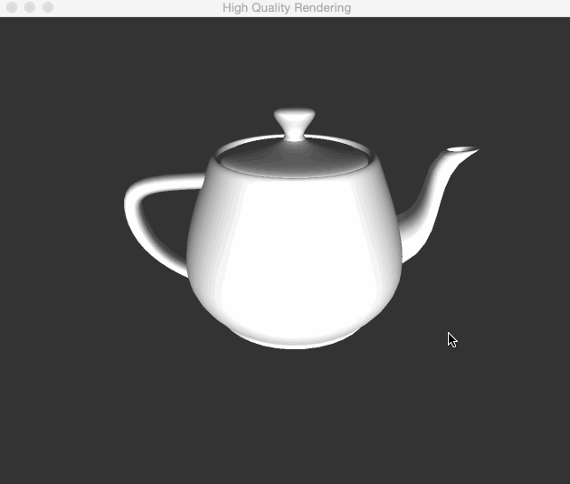

This is the milestone for the final project of `CSE190`. 

## General

I have to say that I've suffered with `GLSL` for a whole week. I picked out useful information on my `GLSL` version, and quickly implemented the phone shader in the beginning of the week. I thought the final project might be a piece of cake, but soon, fell into deep hole of environment mapping and stuck there until now.

## Fragment Shader

Firstly, I implement fragment shader.

## TOO WEIRED!!!

But when I go for environment mapping, I get everything messed up if I use normal to calculate refraction or reflection. 

However, if I use vertex coordinates to approximate normals, everything seems to be right.

But how can it be wrong with normals input? 

## ALSO !!!

There is something more weired for my teapot.
In my vertex shader, there are two lines, if I write like this:

    normal_eyespace = normals/10;
    normal_eyespace = vertex;

I get:

However, if I comment one line, like:

    //normal_eyespace = normals/10;
    normal_eyespace = vertex;

I get:

How can teapot transform?

## Next

I don't have a clean plan now. I've planned to finish all of these in one week, and think about something fancier after that. But now, I think I should go to office hour for help.

