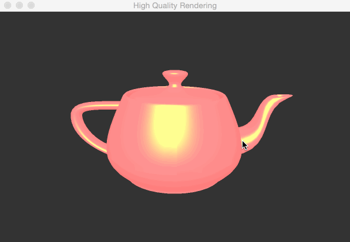
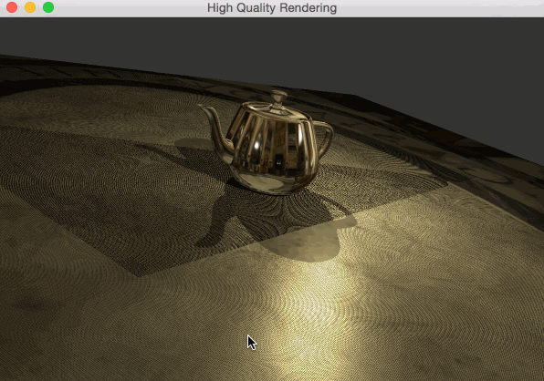
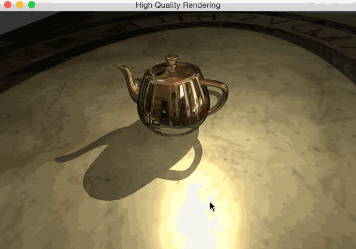
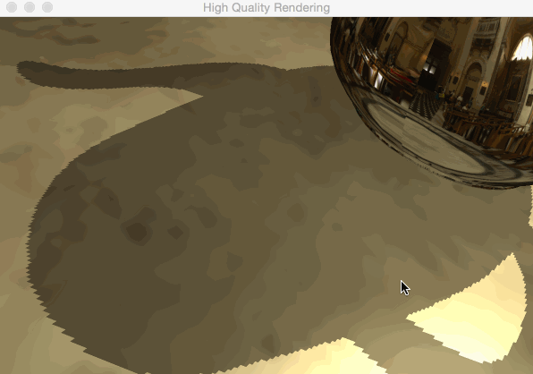
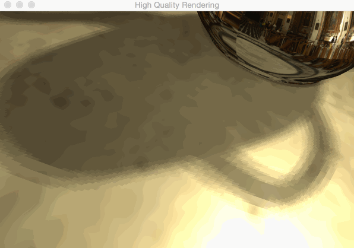
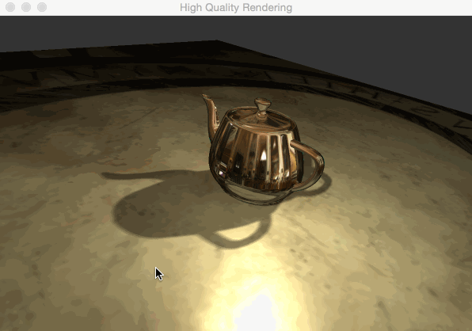

This is the writeup for the third assignment of `CSE190`. As I haven't use `GLSL` shader before, I spend much of the time figuring out those fundamental details. However, after finishing all of these, I feel that the methods and concepts are so straight forward that there are not too many ideas or designs to mention here. Therefore, let me just post up some results and also some of my problems. It might be helpful for future work.

## Per-Fragment Lighting

After finishing implementing most of the fundamental tools for shaders and meshes, like compilation,linking, meshes loading, texture loading etc. I implement a point-light per-fragment phone lighting shader for test.

The problem here is my GLSL version is too low. (Honestly, I don't realize there is a `core-profile` mode for my GPU until much of work is done. I've tried to change to `version 440 core`, however, it seems that one of my supporting library `QGLViewer` is not compatible with `core-profile` mode. I may try this again later with `GLFW`.) There are some deprecated attributes in on-line tutorials which confused me for a while on which built-in attribute can be used directly(like `gl_NormalMatrix`) and which has to be passed in. Also, there is no `inverse()` function in GLSL 1.2, I have to inverse it outside shaders, that is quite inconvenient.

## Environment mapping

I think `Environment mapping` is easier than `Shadow mapping`, so I implement this at first.

A reflection cube:

A invisible cube(refraction cube with ratio = 1):

A silver teapot:

A water teapot:(ratio = 1.33)

The problem here is `glGetAttribLocation()` has to be combined with `glUseProgram()` which means `glGetAttribLocation()` can allocate the same index to attributes with different shader. At first, I thought `glGetAttribLocation()` already contained the shader information, so there is a weired bug as I can not pass in teapot normals to shader. At last, I find out that `glGetAttribLocation()` allocate both teapot normals and environment vertices coordinates to index 0. (It is still weired to me why `openGL` always allocate my normals attribute to index 0, no matter what order I put three attributes).

## Shadow mapping

I Implement shadow mapping with two arbitrary lights (approximating two brightest lights in the environment, not accurate), you may see there are also diffuse and specular.

With shadow acne:

Use shadow bias to deal with artifact. Bias is set from 0.05 to 0.005 according to light direction and normals of fragment.

We have hard shadows in this implementation:

With PCF, we obtain soft shadows:

Change to offset of texture coordinates from 1 to 2:

Therefore, in all

