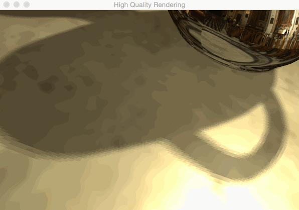
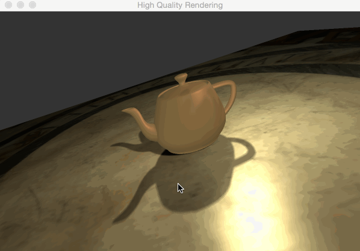

This is the writeup for the third assignment of `CSE190`. As I haven't use `GLSL` shader before, I spend much of the time figuring out those fundamental details. However, after finishing all of these, I feel that the methods and concepts are so straight forward that there are not too many ideas or designs that need to be mentioned here. Basically, I will post up some results and also some problems I met. 

## Per-Fragment Lighting

After finishing implementing most of the fundamental tools for shaders and meshes, like compilation,linking, meshes loading, texture loading etc. I implement a point-light per-fragment phone lighting shader for test.

The problem here is my GLSL version is too low. (Honestly, I don't realize there is a `core-profile` mode for my GPU until much of work is done. I've tried to change to `version 440 core`, however, it seems that one of my supporting library `QGLViewer` is not compatible with `core-profile` mode. I may try this again later with `GLFW`.) There are some deprecated attributes in on-line tutorials which confused me for quite a while on which built-in attribute can be used directly(like `gl_NormalMatrix`) and which has to be passed in. Also, there is no `inverse()` function in GLSL 1.2, I have to inverse it outside shaders, that is quite inconvenient.

## Environment mapping

I think `Environment mapping` is easier than `Shadow mapping`, so I implement this at first.

A reflection cube:

A invisible cube(refraction cube with ratio = 1):

A silver teapot:

A water teapot:(ratio = 1.33)

The problem here is `glGetAttribLocation()` has to be combined with `glUseProgram()` which means `glGetAttribLocation()` can allocate the same index to attributes in different shaders. At first, I thought `glGetAttribLocation()` already contained the shader information, so there is a weired bug as I can not pass in teapot normals to the shader. At last, I find out that `glGetAttribLocation()` allocate both teapot normals and environment cube vertices coordinates to index 0. (It is still weired to me why `openGL` always allocate normals attribute to index 0, no matter what order I put three attributes).

## Shadow mapping

I Implement shadow mapping with two arbitrary lights (approximating two brightest lights in the environment, but not accurate), you may see there are also diffuse and specular lights on the surfaces.

With shadow acne:

Use shadow bias to deal with artifact. Bias is set from 0.05 to 0.005 according to light direction and normals of fragment.

We have hard shadows in this implementation:

With PCF, we obtain soft shadows:

Change to offset of texture coordinates from 1 to 2:

Therefore, in all

## ADD-ON

Basically, I implement environment diffuse shading according to "An Efficient Representation for Irradiance Environment Maps".

First, I calculate 9 parameter as,

|      | R      | G      | B       |
| L00  | 0.44   | 0.37   | 0.23    |
| L1-1 | 0.047  | 0.029  | 0.011   |
| L10  | 0.011  | 0.009  | 0.008   |
| L11  | -0.012 | -0.009 | -0.007  |
| L2-2 | 0.070  | 0.071  | 0.058   |
| L2-1 | 0.018  | 0.011  | 0.003   |
| L20  | -0.073 | -0.064 | -0.049  |
| L21  | 0.007  | 0.003  | -0.0004 |
| L22  | -0.052 | -0.051 | -0.033  |

Send `En` to fragment shader, I obtain:

## End

 Some videos are not clear from my browser, I don't know if you will have the same problem. You may find the original ones in [my Github](https://github.com/kunyao/kunyao.github.io/tree/master/img4). 

