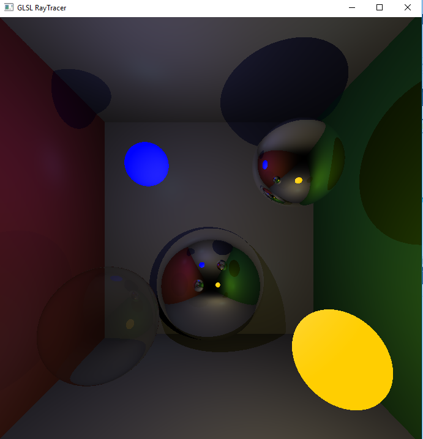

    Team Name: Praise the Sun
    Project Name: WoooooooW 
    Members: Kunyao Chen & Wenchuan Wei

## Short Description

This writeup is for `CSE 167` final project in which we will implement some groundbreaking real-time rendering algorithms. One of them is screen space ray tracing. We will build our project based on [Morgan McGuire etc](http://casual-effects.blogspot.com/2014/08/screen-space-ray-tracing.html). Also, we will model water as our main object, and create vivid wave effect. We hope to achieve a fancy sea scene with natural environment light and soft shadow in real time.

## Plan

We've already had a toy tray tracer with only some spheres in it. It may take a week to get screen space ray tracer work. At the same time, my partner will take care of the water modeling part.

