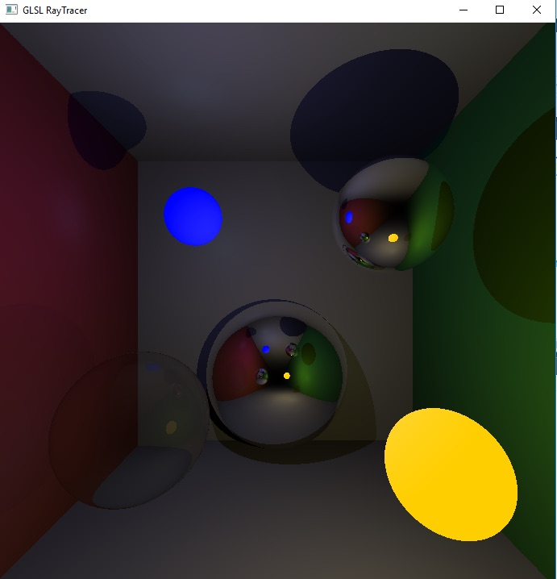
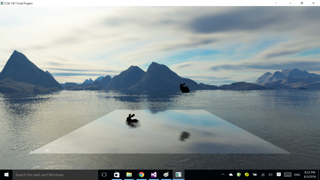

    Team Name: Praise the Sun
    Project Name: On the Sea
    Members: Kunyao Chen & Wenchuan Wei

## Short Description

This writeup is for `CSE 167` final project in which we will implement some groundbreaking real-time rendering techniques. One of them is screen space ray tracing. We will build our project based on [Morgan McGuire etc](http://jcgt.org/published/0003/04/04/). Also, using modeled water as our main object, vivid wave effect will be created. In the end, we hope we can achieve a fancy sea scene with natural environment lights and soft shadows in real time.

## Plan

With a toy ray tracer in hand already, it may take less than a week to get screen space ray tracer work. At the same time, we will take care of the water modeling part. After that, we will integrate everything and maybe add other components.

## Technical Point

    1. Screen space post-processed lights;
    2. Water effect with waves, reflection and refraction;
    3. Sound effects.

## Update on June 3, 2016
We have completed most parts of the water effect and screen space ray tracing. 

### Water effect with reflection and refraction

For the water effect, we first create a plane as the water surface. The normal of every point on this plane is (0,1,0). Then for each frame, we take 2 pictures as the reflection and refraction textures. 
Suppose that the physical camera is places somewhere above the water. And we use it to take a picture only for objects under the water (i.e., the water plane is a clipping plane) as the refraction texture.
For reflection, the camera should be put in the symmetric position under the water surface and only takes picture for objects above the water surface. By mixing the two textures and mapping them onto the water plane, we can see the reflection and refraction effect as shown below.
The picture shows a simple scene. One bunny is placed above the water, and another one's head is above the water while the body is under the water.

### Ripples on the water surface

To make the water more realistic, we want to add some ripples on the water surface. We used a dudv map to realize ripples. Using the red and green components of dudv map as offsets, we can distort the pixels of the reflection and refraction textures. The water surface with ripples is shown below.

### Screen space ray tracing

It could save much time to trace ray in screen space. We choose to build up everything in fragment shader, so the procedure is just like in deferred shading: we save world space normal, position, diffuse color, depth for every pixel in a buffer in the first pass. Then do the ray tracing in screen space in the second pass. The implemntation is annoying: so many transformations and hard to debug in the shader. The biggest issues are as following: 1. There is no simple proportional relationship between camera space cooridnates and screen space cooridnates. The reuslt in [Morgan McGuire's paper](http://jcgt.org/published/0003/04/04/) is not quite accurate. 2. There is an aliasing problem as sample rate of depth buffer is limited. We have to carefully choose `bias` and  `zThickness` to make it right.

We test the result with a simple scene(floor, bunny and a mirror). As we can see, although there is still some aliasings when the angle between view direction and normal is large, also, the bunny in the mirror is sort of blurred, the overall result is quite satisfying. As we focus on real time application, The artifect is enduarable.

